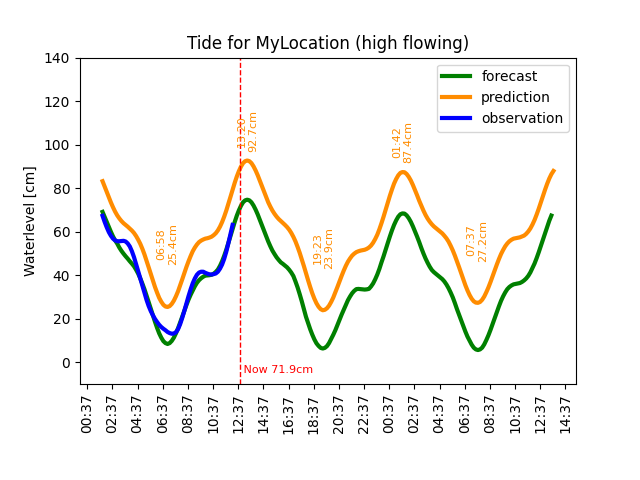

# Norwegian Tide

 


## New version is available


### NB!: This is a Beta version!


This is a Home Assistant custom integration for Norwegian Tide which is interfacing an open API by the [Norwegian Mapping Authority (Kartverket)](https://kartverket.no/en/), more precisely [sehavniva.no](http://www.sehavniva.no/) which provides information about water levels and tidal predicitions and forecasts. **All data is ©[Norwegian Mapping Authority (Kartverket)](https://kartverket.no/en/)**.

Unfortunately the service only provides data for geographical positions in Norway - this is a limitation in the API and not in this integration.

## Configuration
Configuration is done through UI/Lovelace. In Home Assistant, click on Configuration > Integrations where you add it with the + icon.

You will be asked to give your location a name and to provide latitude and longitude as geographical position for the location you want to track. Finally select which sensors you would like the integration to add. More detailed description of this will be added, but in short there is one main sensor which contains all info and for most people probably this may be sufficient. You do not need to add other entities unless you want, but several detailed entities are available if you prefer to have them as separate entities instead of attributes on the main sensor. There is also a camera entity which creates a plot of the data by using Matplotlib.

Entities can be added and removed by clicking *Options* in HA integreation view at any time. It is also possible to enable more than one location by adding the integration several times.

## Usage
Use the integration as you please, but I highly recommend to take a look at the [Apexchart-card](https://github.com/RomRider/apexcharts-card) by Romrider - it is an excellent graph card for lovelace which also enables the possibility to show future values. This is necessary to display prediction- and forecast values which are stored as attributes in the main sensor. Example:

The camera entity can also be used for UI since it proves a nice plot using Matplotlib, but I personally prefer the Apexchart-card since it provides more dynamics. The camera on the other hand can be handy if you would like to send notifications with an included forecast image/plot. It will look something like this:

More detailed description will follow, but worth mentioning:
 - Prediction: A calculated prediction for the location
 - Forecast: Includes the weather effect on top of the prediction
 - Observation: The observed value on the closest station to your location

If you are curious about specific details and definitions, please see [www.sehavniva.no](http://www.sehavniva.no/).

The main sensor will keep the current forecast value as state and will contain all or most data as attributes. The other entities will contain more specific data according to their name.

For further information, see [README](https://github.com/tmjo/ha-norwegiantide)

## License
MIT © [Tor Magne Johannessen][tmjo]. **All data is ©[Norwegian Mapping Authority (Kartverket)](https://kartverket.no/en/)**.
