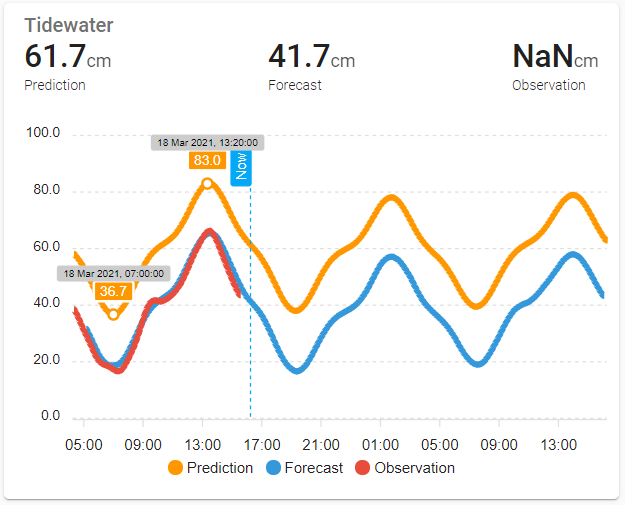

# Norwegian Tide - lovelace examples
[![Buy Me A Coffee][buymeacoffee-image]][buymeacoffee-url]

Just some examples to help you set up lovelace cards with the integration.

By using the [Apexchart-card](https://github.com/RomRider/apexcharts-card) by Romrider - an excellent graph card for lovelace which also enables the possibility to show future values. [yaml](lovelace-apexchart.yaml):

Some more examples [yaml](lovelace-all.yaml):

## License
MIT © [Tor Magne Johannessen][tmjo]

<!-- Badges -->
[buymeacoffee-url]: https://www.buymeacoffee.com/tmjo
[buymeacoffee-image]: https://img.shields.io/badge/support-buymeacoffee-222222.svg?style=flat-square
[tmjo]: https://github.com/tmjo/
